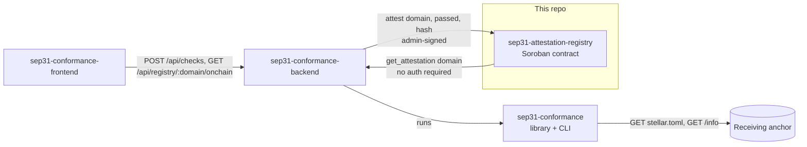
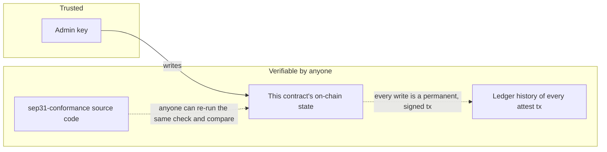
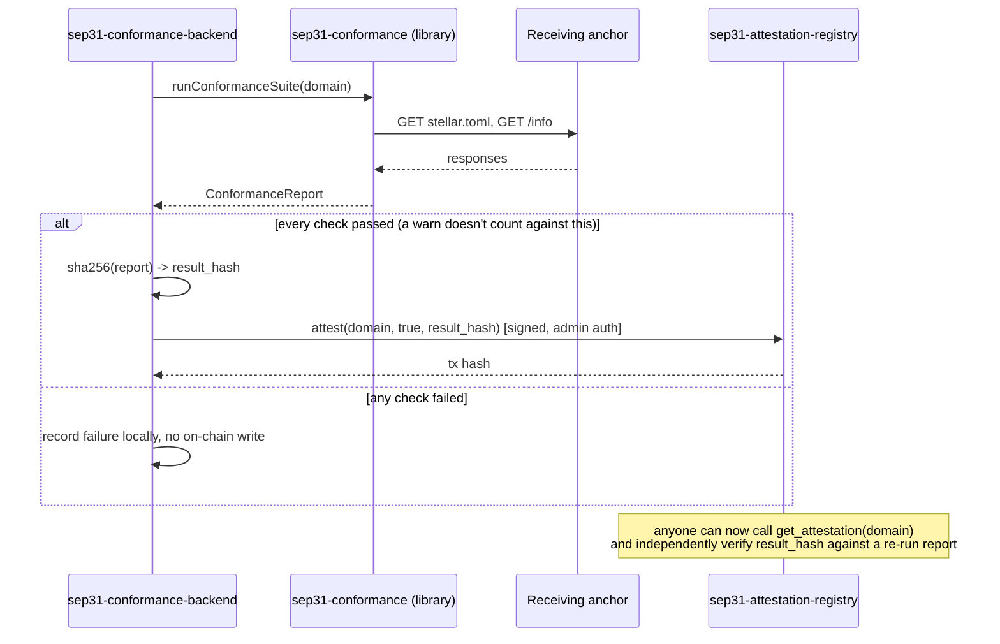

# sep31-attestation-registry

A minimal Soroban smart contract that stores on-chain attestations of
[SEP-31](https://github.com/stellar/stellar-protocol/blob/master/ecosystem/sep-0031.md)
corridor conformance checks — a durable, publicly queryable answer to "is
this receiving anchor's SEP-31 corridor currently verified?" that doesn't
depend on trusting whoever runs the checker.

Part of a project mirroring [`sep24-attestation-registry`](https://github.com/SEP-24-conform/sep24-attestation-registry)'s
exact pattern, applied to SEP-31 instead of SEP-24:

- [`sep31-conformance`](https://github.com/sep31-conformance/sep31-conformance) — the checking library + CLI. Produces the results this contract stores.
- **This repo** — the on-chain record.
- [`sep31-conformance-backend`](https://github.com/sep31-conformance/sep31-conformance-backend) — the API service that runs the checker and writes to this contract.
- [`sep31-conformance-frontend`](https://github.com/sep31-conformance/sep31-conformance-frontend) — dashboard over that backend.



This repo depends on nothing else in the project — pure Soroban contract
code with no knowledge of the checker or backend beyond the shape of the
data it's handed.

## Table of contents

- [Why this exists](#why-this-exists)
- [This contract vs. sep24-attestation-registry](#this-contract-vs-sep24-attestation-registry)
- [Trust model](#trust-model)
- [Data model](#data-model)
- [Interface reference](#interface-reference)
- [Sequence: from check to on-chain record](#sequence-from-check-to-on-chain-record)
- [Deployed instances](#deployed-instances)
- [Storage and TTL considerations](#storage-and-ttl-considerations)
- [Security considerations](#security-considerations)
- [Testing philosophy](#testing-philosophy)
- [Development](#development)
- [Deploying your own instance](#deploying-your-own-instance)
- [Design decisions](#design-decisions)
- [What this deliberately does not do](#what-this-deliberately-does-not-do)
- [FAQ](#faq)
- [Contributing](#contributing)
- [License](#license)

## Why this exists

`sep31-conformance` can tell you, right now, whether a receiving anchor's
SEP-31 discovery surface matches spec. But that result only exists wherever the check
happened to run. A sending anchor deciding whether to trust a corridor —
or a directory site listing verified corridors — needs a durable,
independently queryable answer instead of a one-off terminal output. This
contract is that: an off-chain backend runs the real check, and only on a
pass, submits a signed attestation here.

## This contract vs. sep24-attestation-registry

The underlying problem — "durably record a pass/fail + hash for a domain,
signed by one admin key" — is identical regardless of which SEP is being
attested to, so this contract's Rust source is structurally the same as
[`sep24-attestation-registry`](https://github.com/SEP-24-conform/sep24-attestation-registry)'s.
That's deliberate reuse of a proven, already-audited-in-full pattern, not
duplicated effort by accident — see that repo's own
[Design decisions](https://github.com/SEP-24-conform/sep24-attestation-registry#design-decisions)
for the reasoning behind every choice here (hash-not-full-report, no
history log, no built-in multi-sig). What differs is only the surrounding
context: a separate deployment, a separate admin key, and attestations
that mean "this SEP-31 corridor conforms" rather than "this SEP-24
anchor conforms."

## Trust model

Read carefully — this is the part that determines how much to rely on
this contract for anything real.

This contract does **not** run any checks itself and has no opinion on
what "conformant" means. It's a signed, timestamped bulletin board with
exactly one poster. Concretely:

- **Trust the admin key** to only submit attestations that reflect real
  conformance runs. The admin is a single Stellar account, currently held
  by `sep31-conformance-backend`.
- You do **not** need to trust the admin to *not lie in the future about
  past results* — every write is a Stellar transaction, permanently
  visible in ledger history, signed by the admin key at the time it was
  submitted. The admin can overwrite what the *current* attestation for a
  domain says, but cannot rewrite the historical record of what it
  submitted and when.
- Because `sep31-conformance` is open source, anyone can independently
  re-run the same check the admin claims to have run and compare against
  `result_hash` — the admin's claims are falsifiable, not just asserted.
- If the admin key were compromised, an attacker could write false
  attestations until `set_admin` is used to rotate to a new key. There is
  no multi-signature or governance layer over the admin role in this
  version — see
  [What this deliberately does not do](#what-this-deliberately-does-not-do).



## Data model

```rust
pub struct Attestation {
    pub timestamp: u64,       // ledger close time (unix seconds) when written
    pub passed: bool,         // whether the conformance run had zero failures
    pub result_hash: BytesN<32>,  // hash of the full report, e.g. SHA-256
}
```

A single map from domain (`String`) to its most recent `Attestation`,
overwritten on each new `attest` call — current status, not a history log.

## Interface reference

| Function | Auth required | Description |
|---|---|---|
| `initialize(admin: Address)` | — | One-time setup. Panics if already initialized. |
| `get_admin() -> Address` | — | Returns the current admin address. |
| `set_admin(new_admin: Address)` | current admin | Rotates the admin key. |
| `attest(domain: String, passed: bool, result_hash: BytesN<32>)` | admin | Records a conformance result for `domain`, overwriting any prior attestation for the same domain. |
| `get_attestation(domain: String) -> Option<Attestation>` | — | Reads the latest attestation for `domain`. `None` if never attested. |

## Sequence: from check to on-chain record



## Deployed instances

| Network | Contract ID |
|---|---|
| Testnet | [`CBWQIB3544K3DV3TIUX3WBNA65DHDCK35WJUSUTFWAJSDGOYP24SP2HF`](https://stellar.expert/explorer/testnet/contract/CBWQIB3544K3DV3TIUX3WBNA65DHDCK35WJUSUTFWAJSDGOYP24SP2HF) |
| Mainnet | not yet deployed |

Round-trip verified for real on this testnet deployment: an attestation
for `testanchor.stellar.org` was written and read back correctly,
including the real ledger-assigned timestamp — not just exercised through
the unit test suite in isolation.

## Storage and TTL considerations

Soroban ledger entries — including this contract's persistent storage —
are subject to a rent/TTL model: an entry that isn't extended can expire
and be archived off the live ledger, requiring an explicit restore
operation to read again. This contract uses `env.storage().persistent()`
for attestation records, which means **entries for domains that stop
being re-checked will eventually approach their TTL**.

This version does not automatically bump TTLs on read, and there's no
background job here that extends every stored attestation preemptively —
that responsibility currently sits with whoever operates the admin
backend (re-checking and re-attesting a domain naturally refreshes its
entry's TTL as a side effect of the write).
[`soroban-ttl-doctor`](https://github.com/soroban-doc-ttl/soroban-ttl-doctor) —
a separate project built specifically to audit Soroban contracts for
exactly this risk — is a direct fit for monitoring this contract's own
instance and persistent entries, and was itself validated in part against
its sibling contract `sep24-attestation-registry` during that project's
own development.

## Security considerations

- **Single admin key.** See [Trust model](#trust-model). This is the
  contract's main centralization point, by design — it keeps the contract
  itself small enough to audit in full, at the cost of putting trust in
  whoever holds that one key.
- **No re-entrancy or asset-custody surface.** This contract never holds,
  transfers, or has authority over any asset. It stores two primitive
  fields per domain. The blast radius of a bug here is "wrong attestation
  data," not "loss of funds."
- **`domain` is an unvalidated string.** The contract does not check that
  `domain` looks like a real hostname — that validation happens in
  `sep31-conformance-backend` before it ever calls `attest`. Anyone
  reading from this contract directly (bypassing the backend) should not
  assume `domain` keys are well-formed.
- **Admin rotation is a single transaction with no timelock.** See
  [What this deliberately does not do](#what-this-deliberately-does-not-do)
  and the open proposal tracked in this repo's issues.

## Testing philosophy

7 unit tests. The one worth calling out specifically:
`attest_fails_without_the_admins_authorization`.

Soroban's test harness offers `env.mock_all_auths()`, which makes every
`require_auth()` call in the contract succeed unconditionally — convenient
for testing storage logic, but it means a test suite that only ever calls
`mock_all_auths()` can reach 100% line coverage on `attest()` while never
actually proving the admin-only gate works. That test builds a fresh `Env`
with no blanket auth mock, so `attest`'s `admin.require_auth()` call has
nothing backing it and must panic — the only way to actually verify the
authorization check is load-bearing rather than dead code that happens to
never get exercised as "fail closed." Identical reasoning, and near-identical
code, to [`sep24-attestation-registry`'s equivalent test](https://github.com/SEP-24-conform/sep24-attestation-registry#testing-philosophy) —
worth stating in full here rather than only cross-referenced, since it's
the single most important test in this repo.

## Development

```sh
cargo test              # 7 unit tests, including the negative auth test above
stellar contract build   # -> target/wasm32v1-none/release/registry.wasm (~2.9KB)
```

## Deploying your own instance

```sh
stellar keys generate sep31-registry-admin --network testnet --fund
stellar contract build
stellar contract deploy \
  --wasm target/wasm32v1-none/release/registry.wasm \
  --source sep31-registry-admin --network testnet --alias registry
stellar contract invoke --id registry --source sep31-registry-admin --network testnet -- \
  initialize --admin "$(stellar keys address sep31-registry-admin)"
```

As with the sibling project, the deploying key is not necessarily the key
that should sign attestations day to day — rotate admin via `set_admin`
to a dedicated key held only by whatever backend operates this instance.

## Design decisions

**Why Soroban and not just a regular database the backend controls?** A
database the backend controls is exactly the "trust a centralized list"
problem this whole project exists to avoid. Putting the record on Stellar
means the write is a public, signed, timestamped transaction anyone can
audit independently of the backend's cooperation — including after the
backend disappears.

**Why not store the full report on-chain instead of a hash?** Cost and
boundedness. A JSON report is arbitrary-sized and would make storage cost
scale with report verbosity for no real benefit — a hash is enough to
verify a specific report matches what was attested, at fixed, minimal
cost.

**Why overwrite rather than append a history?** An append-only history
adds unbounded storage growth per domain and complicates the read
interface for the common case (callers almost always want "is this
currently verified," not "show me every historical check"). Kept out of
v0 deliberately — tracked as an open proposal, shared with the sibling
contract, in this repo's issues.

**Why does this contract's source deliberately match
`sep24-attestation-registry`'s instead of being written fresh for SEP-31?**
The underlying problem is identical regardless of which SEP is being
attested to — see
[This contract vs. sep24-attestation-registry](#this-contract-vs-sep24-attestation-registry).
Writing a "fresh" version of the same 90 lines would only introduce a
chance for the two to silently diverge in behavior for no functional
reason.

## What this deliberately does not do

- Run conformance checks itself (that's `sep31-conformance`'s job).
- Store more than the latest attestation per domain.
- Provide any reputation, scoring, or ranking beyond a single pass/fail
  bit.
- Enforce anything about what a "domain" string looks like.
- Provide governance, multi-sig, or timelock protection over the admin
  role.

If any of these turn out to matter for a real use case, they belong in a
new version or a companion contract, not bolted onto this one — see
[Contributing](#contributing).

## FAQ

**Why not just reuse `sep24-attestation-registry`'s deployed contract
instance for SEP-31 attestations too, since the code is identical?**
Because the two record fundamentally different claims — "this domain's
SEP-24 anchor conforms" and "this domain's SEP-31 corridor conforms" are
not the same statement, and a wallet or sending anchor querying this
contract needs to know unambiguously which claim it's reading. Separate
deployments keep that unambiguous; sharing one instance would require
namespacing attestations by SEP within the key, adding complexity to
avoid a code-reuse question that reusing the *source*, not the
*deployment*, already answers more simply.

**Does this contract know or care what SEP-31 actually requires?** No —
same as its sibling, it has no opinion on what "conformant" means; that
logic lives entirely in `sep31-conformance`. This contract only stores
whatever it's told, gated by the admin key.

**What happens if the admin key is lost?** Nothing already-written is
lost — existing attestations remain readable forever via
`get_attestation`. But no *new* attestations can be written, since
`set_admin` itself requires the current admin's signature. There is
currently no recovery path for a fully lost admin key; this would
require a contract upgrade or redeploying and pointing consumers at a
new contract ID.

**Can anyone call `get_attestation`?** Yes — no authentication required,
and it costs only the standard Soroban simulation/read cost, not a full
signed transaction. See `sep31-conformance-backend`'s
`/api/registry/:domain/onchain` endpoint for a worked example of a
trustless read.

See [`sep24-attestation-registry`'s own FAQ](https://github.com/SEP-24-conform/sep24-attestation-registry#faq)
for a couple more entries that apply unchanged (why a plain boolean
result, mainly).

## Contributing

Same extension points as the sibling repo (attestation history, richer
result data, admin governance) — see its
[Contributing](https://github.com/SEP-24-conform/sep24-attestation-registry#contributing)
section. Given the source is intentionally near-identical, a proposal
that makes sense for one likely makes sense for both; consider linking
issues across both repos rather than solving the same design question
twice independently.

## License

Apache-2.0
